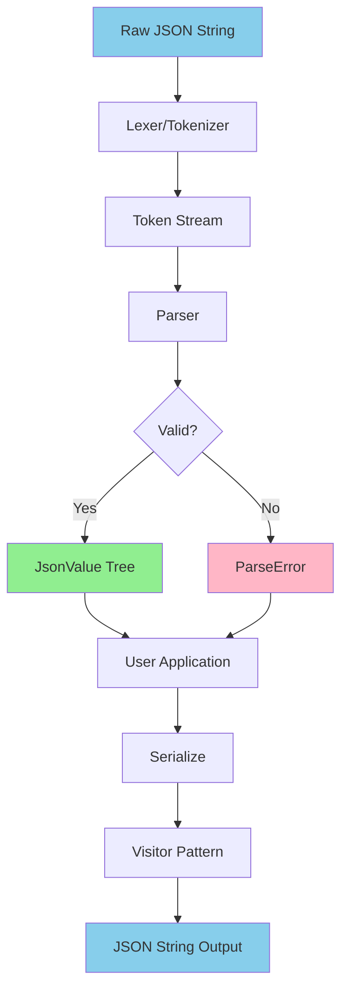
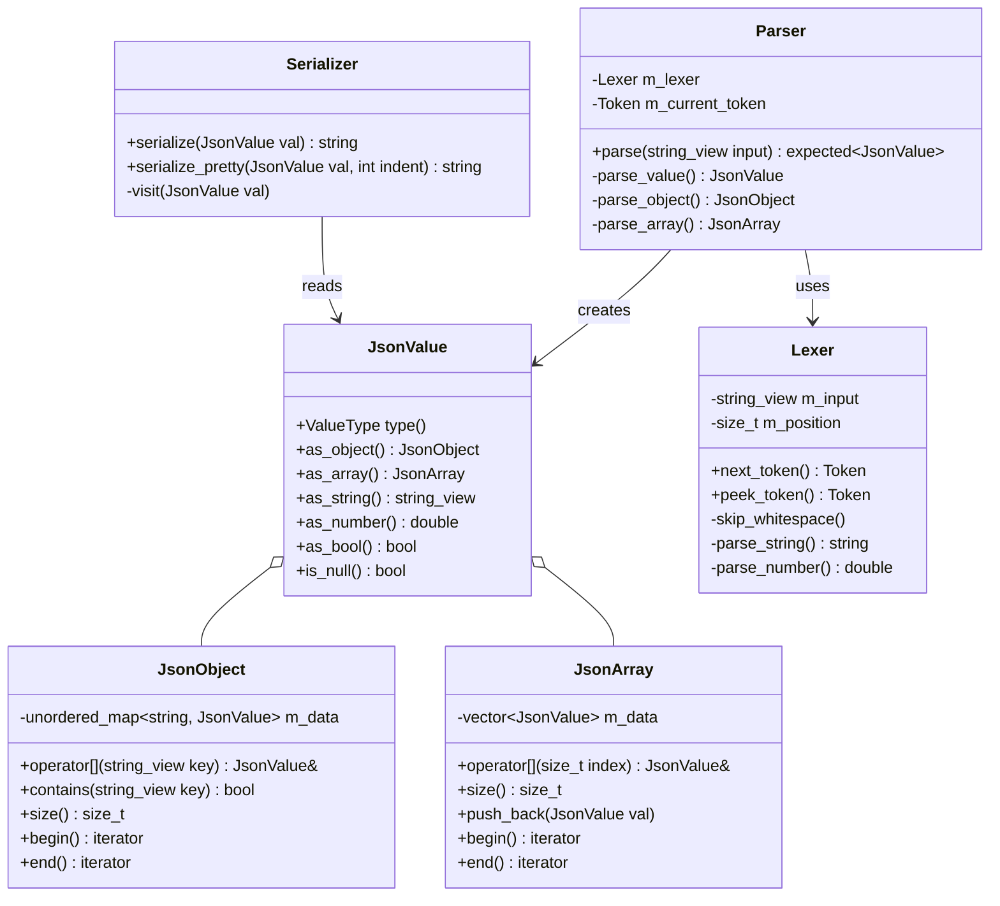

# Cpp Json Architecture

This document describes the high-level architecture and design of the Cpp Json library.

## Overview

Cpp Json is a modern C++23 JSON parsing and serialization library designed with the following goals:

- **Performance**: Zero-copy parsing where possible, minimal allocations
- **Safety**: RAII-based resource management, no naked pointers
- **Ergonomics**: Intuitive API, modern C++ idioms
- **Correctness**: Full RFC 8259 compliance

## System Architecture



## Component Architecture



## Data Flow

### Parsing Flow

1. **Input**: Raw JSON string (UTF-8 encoded)
2. **Lexical Analysis**: 
   - Lexer tokenizes the input into a stream of tokens
   - Handles whitespace, string escaping, number parsing
   - Reports position information for error messages
3. **Syntax Analysis**:
   - Parser consumes tokens from the lexer
   - Builds JsonValue tree using recursive descent
   - Validates JSON structure according to RFC 8259
4. **Output**: 
   - Success: `std::expected<JsonValue, ParseError>` containing the parsed tree
   - Failure: ParseError with line/column information

### Serialization Flow

1. **Input**: JsonValue tree
2. **Traversal**: 
   - Visitor pattern walks the tree
   - Each node type has specialized serialization logic
3. **Output Generation**:
   - Strings are escaped according to JSON spec
   - Numbers are formatted with proper precision
   - Pretty-printing option adds indentation
4. **Output**: UTF-8 JSON string

## Key Design Decisions

### Value Representation

**Variant-based Design**: JsonValue uses `std::variant` internally to represent different JSON types. This provides:
- Type safety at compile time
- No dynamic allocation for primitive types
- Cache-friendly memory layout

```cpp
using JsonValueData = std::variant<
	std::monostate,           // null
	bool,                     // boolean
	double,                   // number
	std::string,              // string
	JsonArray,                // array
	JsonObject                // object
>;
```

### Memory Management

**RAII Everywhere**: All resources are managed through smart pointers and RAII containers:
- `std::unique_ptr` for owned objects
- `std::string_view` for non-owning string references
- `std::vector` and `std::unordered_map` for collections

**Zero-Copy Parsing**: Where possible, string values reference the original input buffer using `std::string_view`, avoiding unnecessary allocations. Deep copies are only made when:
- String contains escape sequences that need processing
- Lifetime of JsonValue exceeds the input buffer

### Error Handling

**Expected-based API**: Parse functions return `std::expected<T, ParseError>` instead of throwing exceptions. This:
- Makes error paths explicit
- Allows for better performance in hot loops
- Gives users control over error handling

Exceptions are reserved for truly exceptional cases (e.g., out of memory).

### Thread Safety

- **Parsing**: Thread-safe. Multiple threads can parse different inputs concurrently
- **JsonValue**: Thread-safe for const operations (reading)
- **Modification**: Not thread-safe. User must synchronize writes

## Performance Characteristics

### Time Complexity

- **Parsing**: O(n) where n is input length
- **Object lookup**: O(1) average (hash map)
- **Array access**: O(1) (vector)
- **Serialization**: O(n) where n is total node count

### Space Complexity

- **Parsed tree**: O(n) where n is number of values
- **Serialization buffer**: O(m) where m is output length

### Optimization Techniques

1. **Small String Optimization (SSO)**: Leverages `std::string` SSO for short strings
2. **Reserve Strategy**: Pre-allocates vectors when array size hints are available
3. **Move Semantics**: Extensive use of move constructors to avoid copies
4. **Branch Prediction**: Hot paths optimized with `[[likely]]` and `[[unlikely]]` attributes

## Extension Points

### Custom Allocators

Users can provide custom allocators through template parameters:

```cpp
template <typename Allocator = std::allocator<char>>
class BasicJsonValue;

using JsonValue = BasicJsonValue<>;
```

### Streaming Parser

For very large JSON files, a streaming API is provided:

```cpp
class StreamParser {
	auto parse_next() -> std::optional<JsonValue>;
	auto has_more() -> bool;
};
```

## Future Enhancements

See [ROADMAP.md](ROADMAP.md) for planned features including:
- SIMD-accelerated parsing
- Memory-mapped file support
- JSON Pointer (RFC 6901)
- JSON Patch (RFC 6902)